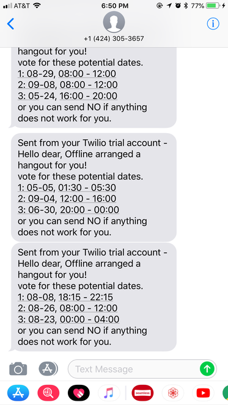

# Scheduling with Google Calendar
[Demo Video](https://youtu.be/qDPPWxxtmxk) 
Multiple users want to schedule a meeting when all of them are available.  

1. Gather each user's schedule from their Google Calendar. 
2. Find empty slots from whole members' schedule and randmonly pick some of them.  
3. Send text messages to users to ask their preference via Twilio.  

